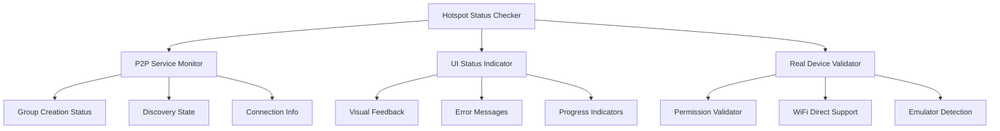

# Design Document

## Overview

This design provides a comprehensive testing and validation framework for the existing hotspot functionality in the Spred application. The system leverages the existing P2PService implementation which uses WiFi Direct groups to create discoverable "hotspots" for peer-to-peer video sharing.

## Architecture

### Current Implementation Analysis

The application already has a robust hotspot implementation through:

1. **P2PService**: Core WiFi Direct service that creates groups (hotspots)
2. **NearbyService**: Wrapper service that bridges P2P functionality with UI components
3. **ShareVideoScreen**: UI component that initiates sharing and displays status

### Testing Framework Components



## Components and Interfaces

### 1. HotspotStatusChecker

**Purpose**: Central service to monitor and report hotspot status

```typescript
interface HotspotStatusChecker {
  // Core status checking
  checkHotspotStatus(): Promise<HotspotStatus>;
  validateP2PService(): Promise<ValidationResult>;
  
  // Real-time monitoring
  subscribeToStatusChanges(callback: StatusCallback): Unsubscribe;
  
  // Testing utilities
  runDiagnostics(): Promise<DiagnosticReport>;
  generateStatusReport(): StatusReport;
}

interface HotspotStatus {
  isActive: boolean;
  mode: 'wifi-direct' | 'hotspot-fallback' | 'disabled';
  groupInfo: GroupInfo | null;
  discoveryState: 'idle' | 'discovering' | 'advertising';
  connectionCount: number;
  error?: string;
}
```

### 2. P2PServiceMonitor

**Purpose**: Monitor the existing P2PService for hotspot-related activities

```typescript
interface P2PServiceMonitor {
  // Monitor existing P2P service
  monitorGroupCreation(): Promise<boolean>;
  checkDiscoveryStatus(): Promise<boolean>;
  validateConnectionInfo(): Promise<WifiP2pInfo | null>;
  
  // Status reporting
  getDetailedStatus(): P2PDetailedStatus;
  isHotspotActive(): boolean;
}

interface P2PDetailedStatus {
  serviceInitialized: boolean;
  groupOwnerStatus: boolean;
  activeConnections: Device[];
  discoveredDevices: Device[];
  lastActivity: Date;
  errorHistory: string[];
}
```

### 3. UIStatusIndicator

**Purpose**: Enhanced UI component to show hotspot status in ShareVideoScreen

```typescript
interface UIStatusIndicator {
  // Status display
  showHotspotStatus(status: HotspotStatus): void;
  updateConnectionCount(count: number): void;
  displayError(error: string, guidance: ErrorGuidance): void;
  
  // Interactive elements
  showRetryOptions(): void;
  showDiagnosticButton(): void;
  showSettingsShortcuts(): void;
}

interface ErrorGuidance {
  title: string;
  message: string;
  actions: string[];
  canAutoFix: boolean;
}
```

### 4. RealDeviceValidator

**Purpose**: Validate functionality on real devices vs emulators

```typescript
interface RealDeviceValidator {
  // Device detection
  isRunningOnEmulator(): Promise<boolean>;
  checkWiFiDirectSupport(): Promise<boolean>;
  validatePermissions(): Promise<PermissionStatus>;
  
  // Testing utilities
  runEmulatorCompatibilityCheck(): Promise<EmulatorTestResult>;
  generateDeviceReport(): DeviceReport;
}
```

## Data Models

### HotspotTestResult

```typescript
interface HotspotTestResult {
  timestamp: Date;
  deviceInfo: DeviceInfo;
  testResults: {
    serviceInitialization: TestStatus;
    groupCreation: TestStatus;
    deviceDiscovery: TestStatus;
    connectionEstablishment: TestStatus;
    fileTransfer: TestStatus;
  };
  performance: {
    initializationTime: number;
    discoveryTime: number;
    connectionTime: number;
  };
  recommendations: string[];
}

interface TestStatus {
  passed: boolean;
  duration: number;
  error?: string;
  details?: any;
}
```

### StatusReport

```typescript
interface StatusReport {
  summary: {
    hotspotActive: boolean;
    mode: string;
    deviceCount: number;
    lastError?: string;
  };
  details: {
    p2pService: P2PServiceStatus;
    nearbyService: NearbyServiceStatus;
    permissions: PermissionStatus;
    networkState: NetworkState;
  };
  diagnostics: DiagnosticInfo[];
  timestamp: Date;
}
```

## Error Handling

### Error Categories

1. **Initialization Errors**
   - P2P service not available
   - Permissions denied
   - WiFi Direct not supported

2. **Runtime Errors**
   - Group creation failed
   - Discovery timeout
   - Connection lost

3. **Environment Errors**
   - Running in emulator
   - WiFi disabled
   - Location services off

### Error Recovery Strategies

```typescript
interface ErrorRecoveryStrategy {
  // Automatic recovery
  retryWithBackoff(operation: () => Promise<boolean>): Promise<boolean>;
  fallbackToHotspot(): Promise<boolean>;
  requestPermissionsWithGuidance(): Promise<boolean>;
  
  // User-guided recovery
  showSettingsGuidance(error: string): ErrorGuidance;
  provideManualSteps(error: string): string[];
}
```

## Testing Strategy

### 1. Unit Testing

- **P2PService Methods**: Test group creation, discovery, connection
- **Status Checking**: Validate status reporting accuracy
- **Error Handling**: Test error scenarios and recovery

### 2. Integration Testing

- **Service Integration**: Test P2PService + NearbyService interaction
- **UI Integration**: Test status display in ShareVideoScreen
- **Permission Flow**: Test permission request and validation

### 3. Device Testing

- **Real Device Tests**: Validate on actual Android devices
- **Emulator Tests**: Verify graceful degradation in emulators
- **Cross-Device Tests**: Test device discovery between different devices

### 4. Performance Testing

- **Initialization Time**: Measure service startup time
- **Discovery Speed**: Time to find nearby devices
- **Connection Establishment**: Time to establish P2P connection

## Implementation Approach

### Phase 1: Status Monitoring
1. Create HotspotStatusChecker service
2. Integrate with existing P2PService
3. Add real-time status monitoring

### Phase 2: UI Enhancement
1. Enhance ShareVideoScreen with status indicators
2. Add diagnostic information display
3. Implement error guidance system

### Phase 3: Testing Framework
1. Create automated test suite
2. Add device validation utilities
3. Implement performance monitoring

### Phase 4: Documentation and Guides
1. Create testing documentation
2. Add troubleshooting guides
3. Document best practices

## Integration Points

### Existing Services Integration

```typescript
// Integration with existing P2PService
class HotspotStatusChecker {
  constructor(private p2pService: P2PService) {
    this.setupP2PMonitoring();
  }
  
  private setupP2PMonitoring() {
    this.p2pService.subscribe((state) => {
      this.updateHotspotStatus(state);
    });
  }
}

// Integration with ShareVideoScreen
const useHotspotStatus = () => {
  const [status, setStatus] = useState<HotspotStatus>();
  
  useEffect(() => {
    const checker = HotspotStatusChecker.getInstance();
    return checker.subscribeToStatusChanges(setStatus);
  }, []);
  
  return status;
};
```

### Logging Integration

```typescript
// Enhanced logging for hotspot operations
class HotspotLogger {
  static logGroupCreation(success: boolean, details: any) {
    logger.info('📡 Hotspot Group Creation:', { success, details });
  }
  
  static logDiscoveryStatus(isDiscovering: boolean, deviceCount: number) {
    logger.info('🔍 Hotspot Discovery:', { isDiscovering, deviceCount });
  }
  
  static logConnectionStatus(isConnected: boolean, connectionInfo: any) {
    logger.info('🤝 Hotspot Connection:', { isConnected, connectionInfo });
  }
}
```

This design leverages your existing robust P2P implementation while adding comprehensive testing and monitoring capabilities to ensure hotspot functionality works reliably across different devices and scenarios.