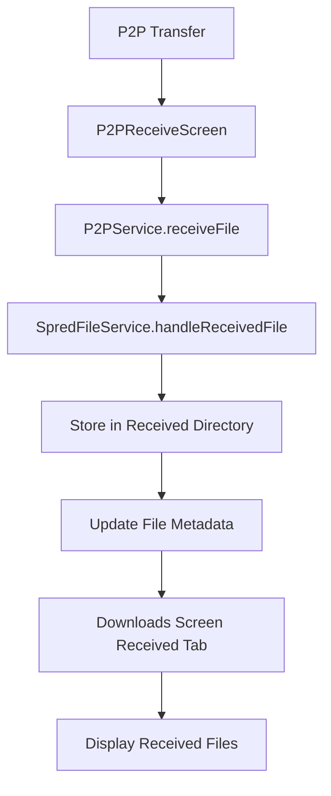

# P2P Received Files Integration Design

## Overview

This design integrates P2P received files with the existing Downloads screen's RECEIVED tab by modifying the P2P service to use SpredFileService for proper file management and ensuring the Downloads screen can display received files correctly.

## Architecture

The integration follows a service-oriented architecture where:

1. **P2P Service Layer**: Handles the actual file transfer protocol
2. **File Management Layer**: SpredFileService manages file storage and metadata
3. **UI Layer**: Downloads screen displays and manages received files



## Components and Interfaces

### Modified P2PService

**Purpose**: Enhanced to integrate with SpredFileService for proper file management

**Key Changes**:
- Remove direct file path handling in `receiveFile` method
- Integrate with SpredFileService for received file processing
- Maintain backward compatibility with existing P2P functionality

**New Interface**:
```typescript
interface P2PService {
  // Modified method
  receiveFile(): Promise<string | null>; // Returns final file path
  
  // New helper method
  private processReceivedFile(tempPath: string, fileName: string): Promise<string>;
}
```

### Enhanced P2PReceiveScreen

**Purpose**: Updated to work with the new P2P service integration

**Key Changes**:
- Remove manual directory creation logic
- Use P2P service's integrated file handling
- Maintain existing UI and user experience

**Modified Methods**:
- `startReceivingFiles()`: Simplified to use new P2P service integration

### SpredFileService Integration

**Purpose**: Leverage existing file management capabilities for received files

**Key Features**:
- Automatic directory structure creation
- File validation and metadata generation
- Proper file naming and conflict resolution

**Used Methods**:
- `initializeDirectories()`: Ensure received directory exists
- `handleReceivedFile()`: Process and store received files
- `getSpredFiles()`: Retrieve all files including received ones

### Downloads Screen Received Tab

**Purpose**: Display received files using existing infrastructure

**Current Implementation**: Already functional, fetches received files through SpredFileService

**Key Features**:
- Displays received files with thumbnails
- Provides play, share, and delete functionality
- Shows appropriate empty state when no files exist

## Data Models

### Enhanced SpredFile Interface

The existing SpredFile interface already supports received files:

```typescript
interface SpredFile {
  id: string;
  name: string;
  path: string;
  size: number;
  type: 'video' | 'audio' | 'image' | 'other';
  mimeType: string;
  createdAt: Date;
  isDownloaded: boolean;
  isReceived: boolean; // Key flag for received files
  sourceUrl?: string;
  thumbnail?: string;
}
```

### File Storage Structure

```
/data/data/com.spred/files/Spred/
├── Downloads/          # Downloaded files (isDownloaded: true)
├── Received/           # P2P received files (isReceived: true)
├── Temp/              # Temporary transfer files
└── Thumbnails/        # Generated thumbnails
```

## Error Handling

### P2P Service Error Handling

1. **File Transfer Failures**: Return null and log appropriate error messages
2. **Storage Failures**: Fallback to temporary storage with user notification
3. **Validation Failures**: Reject invalid files and notify user

### SpredFileService Error Handling

1. **Directory Creation Failures**: Attempt fallback directory creation
2. **File Processing Failures**: Clean up temporary files and return error status
3. **Metadata Generation Failures**: Continue with basic file information

### UI Error Handling

1. **Empty Received List**: Show appropriate empty state message
2. **File Access Errors**: Display user-friendly error messages
3. **Thumbnail Generation Failures**: Show default video icon

## Testing Strategy

### Unit Tests

1. **P2PService Integration**:
   - Test `receiveFile()` method with SpredFileService integration
   - Test error handling for failed file processing
   - Test backward compatibility with existing functionality

2. **SpredFileService**:
   - Test `handleReceivedFile()` method with various file types
   - Test directory creation and file storage
   - Test file validation and metadata generation

### Integration Tests

1. **End-to-End P2P Transfer**:
   - Test complete P2P transfer flow from sender to receiver
   - Verify files appear in Downloads screen Received tab
   - Test file playback from received files

2. **Downloads Screen Integration**:
   - Test received files display correctly
   - Test file operations (play, share, delete) work properly
   - Test empty state display when no received files exist

### Manual Testing

1. **P2P Transfer Scenarios**:
   - Transfer various file types and sizes
   - Test transfer interruption and recovery
   - Test multiple file transfers

2. **User Interface Testing**:
   - Verify received files appear immediately after transfer
   - Test thumbnail generation for received videos
   - Test file management operations from Received tab

## Implementation Approach

### Phase 1: P2P Service Integration
1. Modify P2PService to use SpredFileService
2. Update P2PReceiveScreen to work with new integration
3. Test basic file receiving functionality

### Phase 2: Downloads Screen Verification
1. Verify Downloads screen Received tab works with new integration
2. Test file operations (play, share, delete)
3. Ensure proper error handling and empty states

### Phase 3: Testing and Refinement
1. Comprehensive testing of integration
2. Performance optimization if needed
3. User experience refinements

## Security Considerations

1. **File Validation**: All received files are validated through SpredFileService
2. **Path Sanitization**: File names are sanitized to prevent directory traversal
3. **Storage Isolation**: Received files are stored in app-specific directories
4. **File Size Limits**: SpredFileService enforces reasonable file size limits

## Performance Considerations

1. **Lazy Loading**: Received files list is loaded only when Received tab is accessed
2. **Thumbnail Generation**: Thumbnails are generated asynchronously to avoid blocking UI
3. **File Cleanup**: Temporary files are cleaned up automatically
4. **Memory Management**: Large file operations use streaming where possible