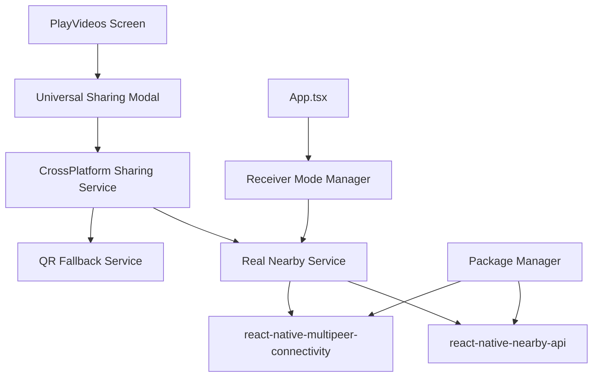

# Design Document

## Overview

This design outlines the integration of real Google Nearby API packages into the SPRED React Native application, replacing mock implementations with production-ready cross-platform sharing functionality. The integration includes package installation, one-tap sharing from PlayVideos screen, and automatic receiver mode initialization.

## Architecture

### Current State Analysis

The application currently has a comprehensive mock implementation with:
- `NearbyService.ts` - Mock-based service with fallback mechanisms
- `CrossPlatformSharingService.ts` - Unified sharing API with QR fallback
- `UniversalSharingModal.tsx` - Complete UI for sharing states
- `PlayVideos.tsx` - Video player with existing P2P sharing integration

### Target Architecture



## Components and Interfaces

### 1. Package Installation Layer

**Real Nearby API Packages:**
- `react-native-nearby-api` - Android Google Nearby Connections
- `react-native-multipeer-connectivity` - iOS Multipeer Connectivity
- Platform-specific native module linking

**Installation Strategy:**
- Conditional installation based on platform requirements
- Graceful fallback to QR-only mode if packages fail
- Comprehensive error logging and diagnostics

### 2. Enhanced NearbyService

**Current Mock Implementation Updates:**
```typescript
// Replace mock imports with real packages
import NearbyApi from 'react-native-nearby-api';
import MultipeerConnectivity from 'react-native-multipeer-connectivity';

// Enhanced initialization with real API validation
async initializeRealAPI(): Promise<boolean> {
  // Platform-specific real API initialization
  // Comprehensive error handling and fallback
  // Permission management integration
}
```

**Key Enhancements:**
- Replace mock device discovery with real API calls
- Implement actual file transfer protocols
- Add connection state management
- Enhanced error handling with specific error codes

### 3. PlayVideos Screen Integration

**One-Tap Sharing Implementation:**
```typescript
// Enhanced SPRED sharing button
const handleSpredShare = useCallback(() => {
  // Replace current P2P flow with Universal Sharing Modal
  setShowUniversalSharingModal(true);
}, []);

// Add Universal Sharing Modal to PlayVideos
<UniversalSharingModal
  visible={showUniversalSharingModal}
  onClose={() => setShowUniversalSharingModal(false)}
  videoPath={getVideoPath()}
  videoTitle={cleanMovieTitle(title)}
  onShareComplete={handleShareComplete}
/>
```

**Integration Points:**
- Replace existing WiFi Direct navigation with modal
- Maintain download requirement validation
- Add share completion feedback
- Preserve existing UI/UX patterns

### 4. Receiver Mode Manager

**App-Level Integration:**
```typescript
// New component: ReceiverModeManager
class ReceiverModeManager {
  async initializeOnAppStart(): Promise<void> {
    // Start background receiver mode
    // Handle incoming transfer notifications
    // Manage received file storage
  }
  
  handleIncomingTransfer(transferData: any): void {
    // Show notification UI
    // Process received video
    // Update video library
  }
}
```

**Background Service Integration:**
- Initialize receiver mode on app startup
- Handle incoming transfers without interrupting playback
- Notification system for transfer requests
- Automatic video library updates

## Data Models

### Enhanced Transfer Models

```typescript
interface RealTransferProgress extends FileTransferProgress {
  connectionType: 'nearby' | 'multipeer' | 'qr_fallback';
  signalStrength?: number;
  estimatedTimeRemaining?: number;
  errorRecoveryAttempts?: number;
}

interface ReceiverModeState {
  isActive: boolean;
  advertisingName: string;
  incomingTransfers: IncomingTransfer[];
  receivedFiles: ReceivedFile[];
  lastActivity: Date;
}

interface IncomingTransfer {
  id: string;
  senderName: string;
  fileName: string;
  fileSize: number;
  progress: number;
  status: 'pending' | 'accepted' | 'receiving' | 'completed' | 'failed';
}
```

### Configuration Models

```typescript
interface RealNearbyConfig {
  serviceId: string;
  deviceName: string;
  autoAcceptTransfers: boolean;
  maxConcurrentTransfers: number;
  transferTimeout: number;
  fallbackToQR: boolean;
  debugMode: boolean;
}
```

## Error Handling

### Comprehensive Error Management

**Error Categories:**
1. **Package Installation Errors**
   - Missing native modules
   - Platform compatibility issues
   - Permission system failures

2. **Runtime API Errors**
   - Connection failures
   - Transfer interruptions
   - Device discovery timeouts

3. **Fallback Scenarios**
   - Automatic QR fallback triggers
   - Graceful degradation paths
   - User notification strategies

**Error Recovery Strategy:**
```typescript
class ErrorRecoveryManager {
  async handleNearbyError(error: NearbyError): Promise<RecoveryAction> {
    switch (error.type) {
      case 'PERMISSION_DENIED':
        return { action: 'fallback_qr', message: 'Using QR code sharing' };
      case 'API_UNAVAILABLE':
        return { action: 'fallback_qr', message: 'Nearby sharing unavailable' };
      case 'CONNECTION_FAILED':
        return { action: 'retry', maxAttempts: 3 };
      default:
        return { action: 'fallback_qr', message: 'Switching to QR sharing' };
    }
  }
}
```

## Testing Strategy

### Real Device Testing

**Test Scenarios:**
1. **Package Installation Testing**
   - Fresh app installation on multiple devices
   - Platform-specific package validation
   - Permission flow testing

2. **Cross-Platform Sharing**
   - Android to iOS transfers
   - iOS to Android transfers
   - Same-platform transfers

3. **Fallback Mechanism Testing**
   - Forced API failures
   - Permission denial scenarios
   - Network connectivity issues

4. **Receiver Mode Testing**
   - Background operation validation
   - Notification system testing
   - File storage verification

### Integration Testing

**Test Framework:**
```typescript
// Enhanced test utilities
class RealNearbyTestSuite {
  async testPackageInstallation(): Promise<TestResult> {
    // Validate package availability
    // Test native module linking
    // Verify API accessibility
  }
  
  async testCrossPlatformSharing(): Promise<TestResult> {
    // Test Android-iOS communication
    // Validate file transfer integrity
    // Measure performance metrics
  }
  
  async testFallbackMechanisms(): Promise<TestResult> {
    // Simulate API failures
    // Validate QR fallback activation
    // Test error message accuracy
  }
}
```

### Performance Testing

**Metrics to Monitor:**
- Package initialization time
- Device discovery latency
- File transfer speeds
- Memory usage during transfers
- Battery impact assessment

## Implementation Phases

### Phase 1: Package Installation and Basic Integration
- Install real Nearby API packages
- Replace mock implementations in NearbyService
- Validate basic device discovery functionality
- Implement comprehensive error handling

### Phase 2: PlayVideos Screen Integration
- Add Universal Sharing Modal to PlayVideos
- Replace existing P2P navigation flow
- Implement one-tap sharing functionality
- Add share completion feedback

### Phase 3: Receiver Mode Implementation
- Create ReceiverModeManager component
- Integrate with app initialization
- Implement background receiver mode
- Add notification system for incoming transfers

### Phase 4: Testing and Optimization
- Comprehensive real device testing
- Cross-platform compatibility validation
- Performance optimization
- User experience refinement

## Security Considerations

### Data Protection
- Encrypt file transfers using platform APIs
- Validate sender identity before accepting transfers
- Implement transfer size limits
- Secure temporary file storage

### Permission Management
- Request minimal required permissions
- Provide clear permission explanations
- Handle permission denial gracefully
- Implement permission re-request flows

### Network Security
- Use platform-provided secure channels
- Validate transfer integrity
- Implement timeout mechanisms
- Monitor for suspicious activity

## Deployment Strategy

### Gradual Rollout
1. **Internal Testing Phase** - Development team validation
2. **Beta Testing Phase** - Limited user group testing
3. **Staged Rollout** - Gradual user base expansion
4. **Full Deployment** - Complete user base activation

### Rollback Plan
- Maintain mock mode as fallback option
- Feature flag for real API activation
- Quick rollback to QR-only mode if needed
- Comprehensive monitoring and alerting