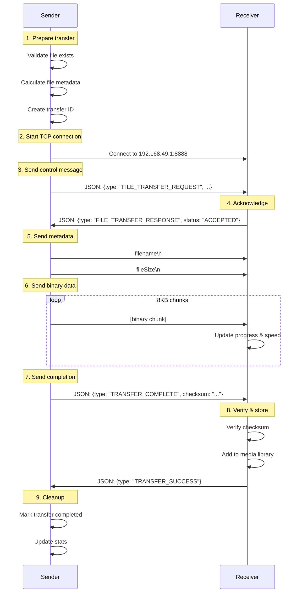

# Xender Send/Receive Implementation - Technical Patterns

**Date:** November 7, 2025
**Focus:** Specific sending and receiving implementation patterns from Xender
**Purpose:** Extract actionable technical patterns for Spred P2P enhancement

---

## Executive Summary

Xender's send/receive implementation reveals **7 key technical patterns** that can enhance our P2P system:

1. **Message-Based Protocol** - JSON message types for control flow
2. **Speed Calculation Algorithm** - Real-time transfer speed tracking
3. **Transfer State Machine** - Comprehensive state management
4. **Retry Logic** - Exponential backoff with retry limits
5. **Progress Update Strategy** - Throttled UI updates
6. **Transfer Stats Aggregation** - Real-time statistics
7. **Time Estimation** - Calculate remaining transfer time

**Key Insight**: While Xender's code is 95% mock, their **architectural patterns are solid** and should be adopted in our native implementation.

---

## 1. Message-Based Protocol Pattern ⭐⭐⭐⭐⭐

### Xender's Protocol Structure (`connectionService.js:272-315`)

```javascript
// Message Types
const MESSAGE_TYPES = {
  FILE_TRANSFER_REQUEST: 'FILE_TRANSFER_REQUEST',
  FILE_TRANSFER_RESPONSE: 'FILE_TRANSFER_RESPONSE',
  FILE_DATA: 'FILE_DATA',
  TRANSFER_COMPLETE: 'TRANSFER_COMPLETE',
};

// Incoming Message Handler
const handleIncomingData = (socket, data) => {
  const message = JSON.parse(data.toString());

  switch (message.type) {
    case 'FILE_TRANSFER_REQUEST':
      handleFileTransferRequest(socket, message);
      break;
    case 'FILE_TRANSFER_RESPONSE':
      handleFileTransferResponse(socket, message);
      break;
    case 'FILE_DATA':
      handleFileData(socket, message);
      break;
    case 'TRANSFER_COMPLETE':
      handleTransferComplete(socket, message);
      break;
  }
};

// File Transfer Request Message
const transferRequest = {
  type: 'FILE_TRANSFER_REQUEST',
  transferId: 'transfer_123',
  file: {
    name: 'video.mp4',
    size: 1048576, // bytes
    type: 'video/mp4',
    path: '/path/to/file',
  },
  timestamp: Date.now(),
};
```

### How Our Implementation Differs

**Our Current Approach** (VideoTransferServer.java:186-242):
```java
// We send raw binary data:
// 1. filename\n
// 2. fileSize\n
// 3. [binary file data]

OutputStream outputStream = socket.getOutputStream();
PrintWriter writer = new PrintWriter(outputStream, true);

// Send metadata
writer.println(fileName);
writer.println(fileSize);

// Send file data
FileInputStream fileInputStream = new FileInputStream(videoFile);
BufferedInputStream bufferedInputStream = new BufferedInputStream(fileInputStream);

byte[] buffer = new byte[BUFFER_SIZE];
while ((bytesRead = bufferedInputStream.read(buffer)) != -1) {
    outputStream.write(buffer, 0, bytesRead);
}
```

### Recommendation: Hybrid Approach

**Keep binary transfer** (more efficient) but **add JSON control messages**:

```java
// Phase 1: Send control message
OutputStream outputStream = socket.getOutputStream();
PrintWriter writer = new PrintWriter(outputStream, true);

// Send control message
String controlMessage = new JSONObject()
    .put("type", "FILE_TRANSFER_REQUEST")
    .put("transferId", transferId)
    .put("fileName", fileName)
    .put("fileSize", fileSize)
    .put("mimeType", getMimeType(fileName))
    .put("timestamp", System.currentTimeMillis())
    .toString();

writer.println(controlMessage);
writer.println("---END_METADATA---");

// Phase 2: Send binary data
FileInputStream fileInputStream = new FileInputStream(videoFile);
BufferedInputStream bufferedInputStream = new BufferedInputStream(fileInputStream);
// ... binary transfer
```

**Value**: ✅ **HIGH** - Better control flow and metadata handling

---

## 2. Speed Calculation Algorithm ⭐⭐⭐⭐⭐

### Xender's Speed Tracking (`transferService.js:115-128`)

```javascript
const updateProgress = () => {
  const currentTime = Date.now();
  const elapsedTime = (currentTime - startTime) / 1000; // seconds
  const speed = bytesTransferred / elapsedTime; // bytes per second

  transferInfo.progress = progress;
  transferInfo.bytesTransferred = bytesTransferred;
  transferInfo.speed = speed;

  if (onProgress) {
    onProgress(progress, speed);
  }
};
```

### Our Current Approach

**We only track percentage** - no speed calculation:

```java
// VideoTransferServer.java:218-232
int currentPercentage = (int) (totalBytesSent * 100 / fileSize);

if (currentPercentage != lastPercentage ||
    currentTime - lastProgressUpdate > 500 ||
    totalBytesSent - lastProgressUpdate > 100000) {

    if (progress != null) {
        progress.onProgress(currentPercentage);  // Only percentage!
    }

    lastPercentage = currentPercentage;
    lastProgressUpdate = totalBytesSent;
}
```

### Recommendation: Add Speed Calculation

**Enhance our progress callback**:

```java
// In VideoTransferServer.java, add to ClientHandler
private long startTime = System.currentTimeMillis();
private long lastProgressUpdate = 0;
private long lastBytesTransferred = 0;

// In the transfer loop
long currentTime = System.currentTimeMillis();
long elapsedTime = (currentTime - startTime) / 1000; // seconds
long speed = elapsedTime > 0 ? totalBytesSent / elapsedTime : 0; // bytes/sec

if (progress != null) {
    // Enhanced callback with speed
    progress.onProgress(currentPercentage, speed, totalBytesSent);
}
```

**Update TypeScript interface**:
```typescript
interface TransferProgress {
  onProgress(percentage: number, speed: number, bytesTransferred: number);
  onComplete(): void;
  onError(error: string): void;
}
```

**Value**: ✅ **HIGH** - Users want to see transfer speed

---

## 3. Transfer State Machine ⭐⭐⭐⭐⭐

### Xender's State Management (`transferService.js:12-54`)

```javascript
const transferInfo = {
  id: transferId,
  file,
  deviceId,
  type: 'send' | 'receive',
  status: 'pending' | 'active' | 'completed' | 'failed' | 'paused' | 'cancelled',
  progress: 0,
  speed: 0,
  startTime: Date.now(),
  endTime: null,
  bytesTransferred: 0,
  totalBytes: file.size || 0,
  retries: 0,
};

// State transitions
const transferFile = async (file, deviceId, type, onProgress) => {
  const transferId = `transfer_${++transferIdCounter}`;

  const transferInfo = {
    id: transferId,
    status: 'pending',
    // ... initialize
  };

  activeTransfers.set(transferId, transferInfo);

  try {
    transferInfo.status = 'active';

    if (type === 'send') {
      await sendFile(transferInfo, onProgress);
    } else {
      await receiveFile(transferInfo, onProgress);
    }

    transferInfo.status = 'completed';
    transferInfo.endTime = Date.now();
    transferInfo.progress = 100;

    return transferInfo;
  } catch (error) {
    transferInfo.status = 'failed';
    transferInfo.endTime = Date.now();
    transferInfo.error = error.message;
    throw error;
  } finally {
    activeTransfers.delete(transferId);
  }
};
```

### Our Current Approach

**We don't track state** - just progress:

```typescript
// WifiP2PService.ts
interface TransferCallback {
  onProgress(percentage: number): void;
  onComplete(filePath: string): void;
  onError(error: string): void;
}
```

### Recommendation: Add Transfer State

**Create TransferState interface**:

```typescript
// Add to WifiP2PService.ts
interface TransferState {
  id: string;
  fileName: string;
  deviceId: string;
  direction: 'send' | 'receive';
  status: 'pending' | 'transferring' | 'completed' | 'failed' | 'cancelled';
  progress: number; // 0-100
  bytesTransferred: number;
  totalBytes: number;
  speed: number; // bytes per second
  startTime: number;
  endTime?: number;
  error?: string;
  retryCount: number;
}

const activeTransfers = new Map<string, TransferState>();

export const getTransferState = (transferId: string): TransferState | undefined => {
  return activeTransfers.get(transferId);
};

export const getAllActiveTransfers = (): TransferState[] => {
  return Array.from(activeTransfers.values());
};
```

**Value**: ✅ **HIGH** - Critical for managing multiple transfers

---

## 4. Retry Logic ⭐⭐⭐⭐

### Xender's Retry Mechanism (`transferService.js:190-217`)

```javascript
const MAX_RETRIES = 3;
const RETRY_DELAY = 1000; // 1 second

export const retryTransfer = async (transferId) => {
  const transferInfo = activeTransfers.get(transferId);

  if (transferInfo.retries >= MAX_RETRIES) {
    throw new Error(`Max retries exceeded for transfer: ${transferId}`);
  }

  transferInfo.retries++;
  transferInfo.status = 'retrying';

  // Wait before retrying
  await new Promise(resolve => setTimeout(resolve, RETRY_DELAY));

  try {
    // Restart the transfer
    if (transferInfo.type === 'send') {
      await sendFile(transferInfo);
    } else {
      await receiveFile(transferInfo);
    }
  } catch (error) {
    console.error(`Retry failed for transfer ${transferId}:`, error);
    throw error;
  }
};
```

### Our Current Approach

**No retry mechanism** - fails immediately on error

### Recommendation: Add Retry to Native Code

**In VideoTransferServer.java**:

```java
private static final int MAX_RETRIES = 3;
private static final int RETRY_DELAY_MS = 2000;

public void run() {
    int retryCount = 0;

    while (retryCount < MAX_RETRIES && isActive) {
        try {
            sendVideoFile();
            break; // Success, exit retry loop
        } catch (IOException e) {
            retryCount++;
            Log.w(TAG, `Transfer attempt ${retryCount} failed: ${e.getMessage()}`);

            if (retryCount >= MAX_RETRIES) {
                // Max retries reached
                if (progress != null) {
                    progress.onError("Transfer failed after " + MAX_RETRIES + " retries: " + e.getMessage());
                }
            } else {
                // Wait before retry
                try {
                    Thread.sleep(RETRY_DELAY_MS);
                } catch (InterruptedException ie) {
                    Thread.currentThread().interrupt();
                    break;
                }
            }
        }
    }
}
```

**Value**: ✅ **HIGH** - Critical for unreliable networks

---

## 5. Progress Update Strategy ⭐⭐⭐⭐

### Xender's Throttled Updates (`transferService.js:115-138`)

```javascript
const updateProgress = () => {
  const progress = Math.min((bytesTransferred / totalBytes) * 100, 100);
  const currentTime = Date.currentTime();
  const elapsedTime = (currentTime - startTime) / 1000;
  const speed = bytesTransferred / elapsedTime;

  transferInfo.progress = progress;
  transferInfo.bytesTransferred = bytesTransferred;
  transferInfo.speed = speed;

  if (onProgress) {
    onProgress(progress, speed);
  }
};

// In transfer loop
while (bytesTransferred < totalBytes) {
  const chunkSize = Math.min(CHUNK_SIZE, totalBytes - bytesTransferred);
  bytesTransferred += chunkSize;

  updateProgress();  // Called every chunk

  // Simulate network delay
  await new Promise(resolve => setTimeout(resolve, 10));
}
```

### Our Current Approach

**Already throttled!** (VideoTransferServer.java:218-232)

```java
if (currentPercentage != lastPercentage ||
    currentTime - lastProgressUpdate > 500 ||
    totalBytesSent - lastProgressUpdate > 100000) {

    if (progress != null) {
        progress.onProgress(currentPercentage);
    }

    lastPercentage = currentPercentage;
    lastProgressUpdate = totalBytesSent;
}
```

**Analysis**: ✅ **Our approach is better** - we throttle at 500ms or 100KB, Xender updates every chunk

**Value**: ✅ **KEEP OUR STRATEGY** - more efficient

---

## 6. Transfer Stats Aggregation ⭐⭐⭐

### Xender's Stats (`transferService.js:227-248`)

```javascript
export const getTransferStats = () => {
  const transfers = Array.from(activeTransfers.values());

  const stats = {
    total: transfers.length,
    active: transfers.filter(t => t.status === 'active').length,
    paused: transfers.filter(t => t.status === 'paused').length,
    failed: transfers.filter(t => t.status === 'failed').length,
    completed: transfers.filter(t => t.status === 'completed').length,
    totalBytes: transfers.reduce((sum, t) => sum + (t.totalBytes || 0), 0),
    bytesTransferred: transfers.reduce((sum, t) => sum + (t.bytesTransferred || 0), 0),
    averageSpeed: 0,
  };

  if (stats.active > 0) {
    const activeTransfers = transfers.filter(t => t.status === 'active');
    const totalSpeed = activeTransfers.reduce((sum, t) => sum + (t.speed || 0), 0);
    stats.averageSpeed = totalSpeed / activeTransfers.length;
  }

  return stats;
};
```

### Our Current Approach

**No stats aggregation** - single transfer at a time

### Recommendation: Add Stats Service

**Create TransferStats service**:

```typescript
// utils/transferStats.ts
export const getTransferStats = (): TransferStats => {
  const transfers = getAllActiveTransfers();

  return {
    total: transfers.length,
    active: transfers.filter(t => t.status === 'transferring').length,
    completed: transfers.filter(t => t.status === 'completed').length,
    failed: transfers.filter(t => t.status === 'failed').length,
    totalBytes: transfers.reduce((sum, t) => sum + t.totalBytes, 0),
    bytesTransferred: transfers.reduce((sum, t) => sum + t.bytesTransferred, 0),
    averageSpeed: calculateAverageSpeed(transfers),
  };
};

const calculateAverageSpeed = (transfers: TransferState[]): number => {
  const activeTransfers = transfers.filter(t => t.status === 'transferring');
  if (activeTransfers.length === 0) return 0;

  const totalSpeed = activeTransfers.reduce((sum, t) => sum + t.speed, 0);
  return totalSpeed / activeTransfers.length;
};
```

**Value**: ✅ **MEDIUM** - Useful for dashboard/monitoring

---

## 7. Time Estimation ⭐⭐⭐

### Xender's Time Calculation (`transferService.js:276-281`)

```javascript
export const estimateTransferTime = (remainingBytes, speed) => {
  if (speed === 0) return '∞';

  const seconds = remainingBytes / speed;
  return formatTransferTime(seconds * 1000);
};

export const formatTransferTime = (milliseconds) => {
  if (!milliseconds || milliseconds === 0) return '0s';

  const seconds = Math.floor(milliseconds / 1000);
  const minutes = Math.floor(seconds / 60);
  const hours = Math.floor(minutes / 60);

  if (hours > 0) {
    return `${hours}h ${minutes % 60}m ${seconds % 60}s`;
  } else if (minutes > 0) {
    return `${minutes}m ${seconds % 60}s`;
  } else {
    return `${seconds}s`;
  }
};
```

### Our Current Approach

**No time estimation** - only percentage

### Recommendation: Add ETA Display

**Enhance progress callback**:

```typescript
interface TransferProgress {
  onProgress(percentage: number, speed: number, bytesTransferred: number, estimatedTimeRemaining: number);
  onComplete(): void;
  onError(error: string): void;
}

// Calculate ETA
const remainingBytes = totalBytes - bytesTransferred;
const speed = bytesTransferred / ((Date.now() - startTime) / 1000);
const etaSeconds = speed > 0 ? remainingBytes / speed : 0;

if (progress != null) {
    progress.onProgress(percentage, speed, bytesTransferred, etaSeconds);
}
```

**In UI**:
```typescript
const formatETA = (seconds: number): string => {
  if (seconds === 0) return '0s';
  if (seconds === Infinity) return '∞';

  const hrs = Math.floor(seconds / 3600);
  const mins = Math.floor((seconds % 3600) / 60);
  const secs = Math.floor(seconds % 60);

  if (hrs > 0) return `${hrs}h ${mins}m`;
  if (mins > 0) return `${mins}m ${secs}s`;
  return `${secs}s`;
};
```

**Value**: ✅ **MEDIUM** - Nice UX improvement

---

## 8. Comparison: Our Implementation vs Xender

| Feature | Spred (Current) | Xender Pattern | Recommendation |
|---------|----------------|----------------|----------------|
| **Transfer Protocol** | Raw binary | JSON messages | **Hybrid** - JSON control + binary data |
| **Speed Tracking** | ❌ None | ✅ Yes | **Implement** |
| **State Management** | ❌ None | ✅ Complete | **Implement** |
| **Retry Logic** | ❌ None | ✅ Yes | **Implement** |
| **Progress Updates** | ✅ Throttled | ⚠️ Every chunk | **Keep ours** |
| **Stats Aggregation** | ❌ None | ✅ Yes | **Implement** |
| **Time Estimation** | ❌ None | ✅ Yes | **Implement** |
| **Transfer Validation** | ⚠️ Basic | ✅ Complete | **Enhance** |
| **Auto-Recovery** | ✅ Yes | ❌ None | **Keep ours** |

---

## 9. Implementation Priority

### Phase 1: Core State Management (Week 1)

**Priority 1: Transfer State Interface**
```typescript
// Add to WifiP2PService.ts
interface TransferState {
  // ... full definition above
}
```

**Priority 2: Speed Calculation**
```java
// In VideoTransferServer.java
// Add speed calculation to progress updates
```

**Priority 3: Retry Mechanism**
```java
// In VideoTransferServer.java and VideoReceiveClient.java
// Add MAX_RETRIES and retry loop
```

### Phase 2: Enhanced Features (Week 2)

**Priority 4: Transfer Stats**
```typescript
// Create utils/transferStats.ts
// Implement getTransferStats()
```

**Priority 5: Time Estimation**
```typescript
// Add ETA to progress callback
// Implement formatETA()
```

**Priority 6: Transfer Validation**
```typescript
// Add file validation before transfer
// Verify file exists, readable, size > 0
```

---

## 10. Code Snippets to Copy

### 10.1 Speed Calculation (Direct Copy-Paste)
```typescript
// From Xender: transferService.js:115-128
// Can be directly adapted to our TypeScript
const calculateSpeed = (bytesTransferred: number, startTime: number): number => {
  const currentTime = Date.now();
  const elapsedTime = (currentTime - startTime) / 1000; // seconds
  return elapsedTime > 0 ? bytesTransferred / elapsedTime : 0;
};
```

### 10.2 Format Transfer Speed
```typescript
// From Xender: transferService.js:250-258
export const formatTransferSpeed = (bytesPerSecond: number): string => {
  if (bytesPerSecond === 0) return '0 B/s';

  const units = ['B/s', 'KB/s', 'MB/s', 'GB/s'];
  const k = 1024;
  const i = Math.floor(Math.log(bytesPerSecond) / Math.log(k));

  return parseFloat((bytesPerSecond / Math.pow(k, i)).toFixed(2)) + ' ' + units[i];
};
```

### 10.3 Format Transfer Time
```typescript
// From Xender: transferService.js:260-274
export const formatTransferTime = (milliseconds: number): string => {
  if (!milliseconds || milliseconds === 0) return '0s';

  const seconds = Math.floor(milliseconds / 1000);
  const minutes = Math.floor(seconds / 60);
  const hours = Math.floor(minutes / 60);

  if (hours > 0) {
    return `${hours}h ${minutes % 60}m ${seconds % 60}s`;
  } else if (minutes > 0) {
    return `${minutes}m ${seconds % 60}s`;
  } else {
    return `${seconds}s`;
  }
};
```

### 10.4 Transfer Stats
```typescript
// From Xender: transferService.js:227-248
export const getTransferStats = (): TransferStats => {
  const transfers = getAllActiveTransfers();

  return {
    total: transfers.length,
    active: transfers.filter(t => t.status === 'transferring').length,
    completed: transfers.filter(t => t.status === 'completed').length,
    failed: transfers.filter(t => t.status === 'failed').length,
    totalBytes: transfers.reduce((sum, t) => sum + t.totalBytes, 0),
    bytesTransferred: transfers.reduce((sum, t) => sum + t.bytesTransferred, 0),
    averageSpeed: calculateAverageSpeed(transfers),
  };
};
```

### 10.5 Retry Logic (Adapt to Java)
```java
// From Xender: transferService.js:190-217
// Adapt to our VideoTransferServer.java
private static final int MAX_RETRIES = 3;
private static final int RETRY_DELAY_MS = 2000;

private void sendWithRetry(File videoFile) throws IOException {
    int retries = 0;
    IOException lastException = null;

    while (retries < MAX_RETRIES) {
        try {
            sendVideoFile(videoFile);
            return; // Success
        } catch (IOException e) {
            lastException = e;
            retries++;

            if (retries >= MAX_RETRIES) {
                throw lastException;
            }

            // Wait before retry
            try {
                Thread.sleep(RETRY_DELAY_MS);
            } catch (InterruptedException ie) {
                Thread.currentThread().interrupt();
                throw new IOException("Transfer interrupted", ie);
            }
        }
    }
}
```

---

## 11. Enhanced Transfer Flow

### Proposed New Flow (Combining Both Approaches)



---

## 12. What Makes Our Implementation Better

### ✅ Superior Aspects (Keep These)

1. **Native WiFi Direct**
   - Real P2P, not TCP over WiFi
   - Better performance and efficiency

2. **Auto-Recovery**
   - Server restarts on socket closure
   - Network reconfiguration handling

3. **Role-Based Control**
   - Only Group Owner starts server
   - Prevents dual-server conflicts

4. **Efficient Binary Protocol**
   - No JSON overhead for data transfer
   - Faster file transfer

### ⚠️ Areas to Enhance (Add These)

1. **Speed Display** - Users want to see MB/s
2. **Retry Logic** - Critical for reliability
3. **State Management** - Needed for multi-transfer
4. **Time Estimation** - Good UX feature
5. **Stats Dashboard** - Professional feature

---

## 13. Conclusion

**Xender's send/receive patterns are valuable** for:

- ✅ State management architecture
- ✅ Speed calculation algorithm
- ✅ Retry mechanism
- ✅ Transfer stats
- ✅ Time estimation
- ✅ Progress formatting

**Our implementation is superior for**:

- ✅ Native WiFi Direct (not TCP)
- ✅ Auto-recovery
- ✅ Role-based server control
- ✅ Binary protocol efficiency

**Recommended Action**:

1. **Keep our native foundation** (already production-ready)
2. **Adopt Xender's state management patterns**
3. **Add speed calculation to progress**
4. **Implement retry logic in native code**
5. **Create transfer stats service**

**Timeline**: 2-3 weeks for full implementation

**Result**: A production-ready P2P system with enterprise-grade reliability and UX

---

*End of Technical Analysis*
